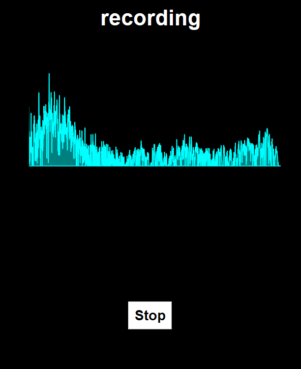
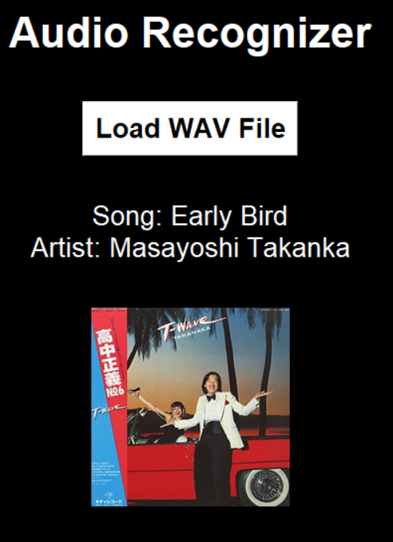

# SongApp README - EN
 Advanced mathematics group project - Fourier Transform Application

 Python app that takes a *".wav" file* and transforms it to a frequency using *Fourier's Transform* then matches it to a song from our database.

# build?

* install the needed libraries:
***"pip install numpy scipy matplotlib pyaudio tkinter"***

* For the real time mic input to frequency over amplitude:
   ***run -> python app.py***

* For the 10 second .wav recognizer:
   ***run -> python testAPP.py***

# Add songs to database
* Make a folder named songs
* Save the wav file wanted as: *"Song Name - Artist.wav"*
* Save the song's cover exactly the same (*"Song Name - Artist.wav"*)
* Run createDatabase.py 

//Only new songs will be added as long as you don't change their name in the folder, song that are already in the .db will be skipped.